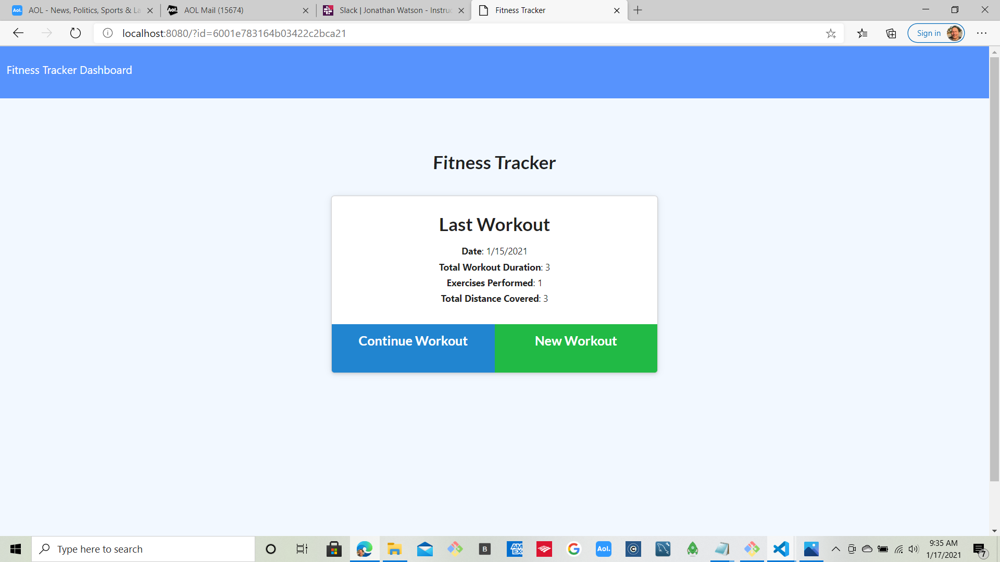
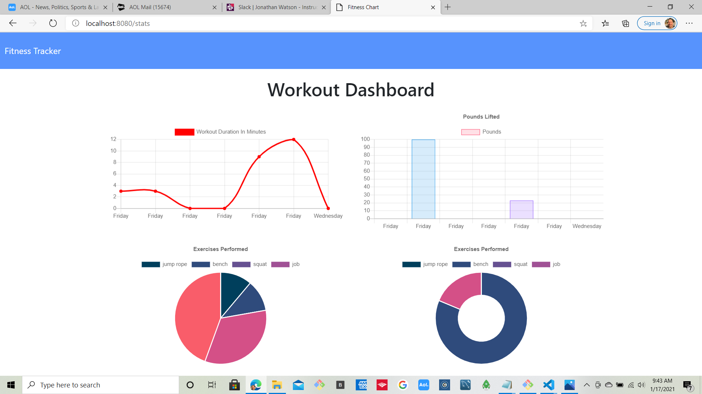
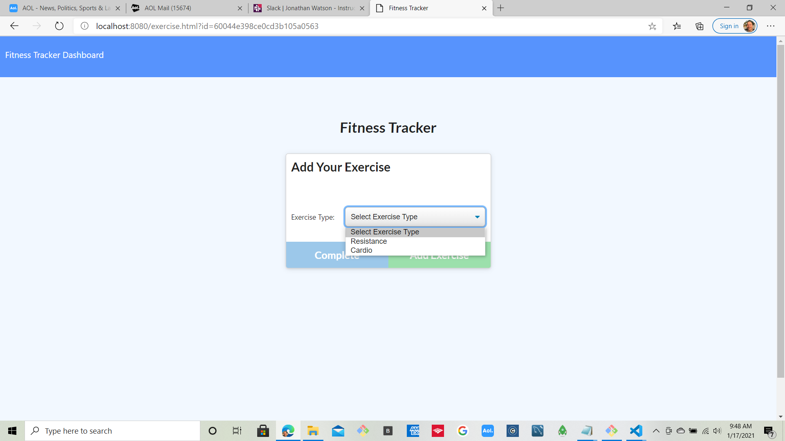
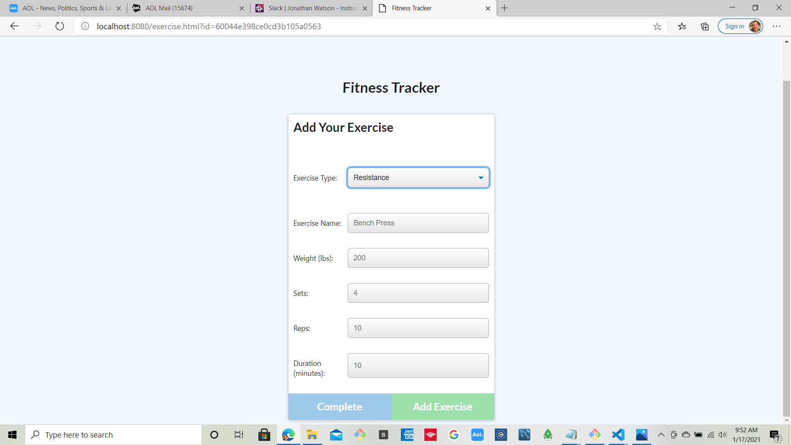
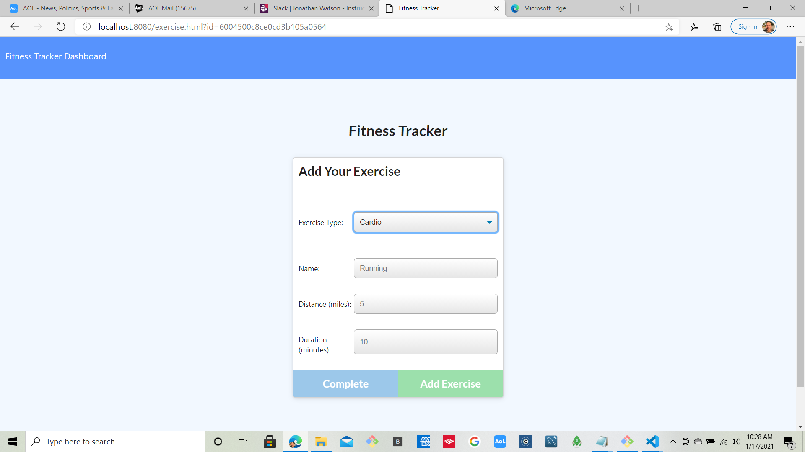
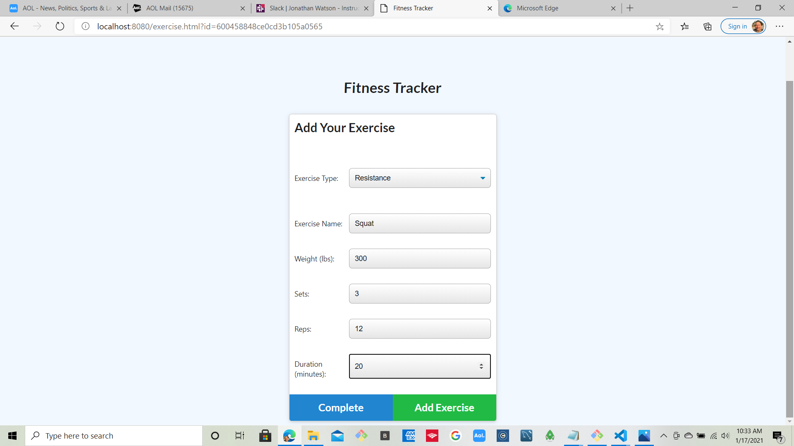
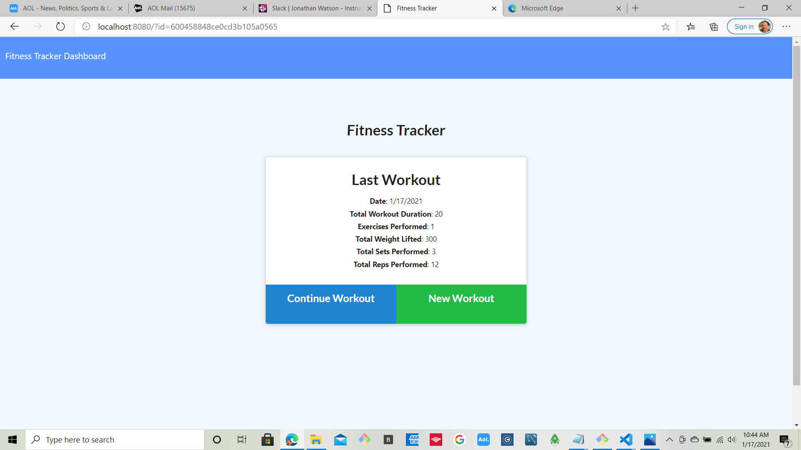
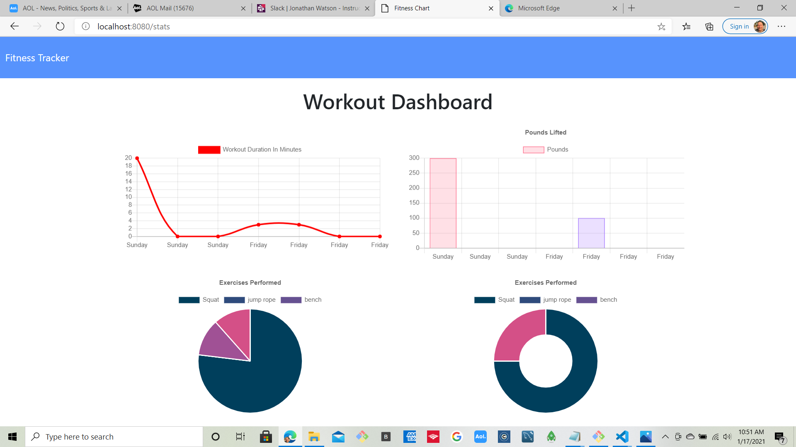

# workout-project

## Objective

To create workout routines ( Resistance / Cardio) where the user can add additional exercises to each type of routine and at the same time monitor their progress.

## Software used in project

a) Express
b) Mongoose DB
c) Models
d) Routes (api / html)

## Screen Layout

## Introductory Screen:

This Page is the start point for which a workout is created or
modified. It will also display the results of the last workout
performed

## Dashoboard Screen

This page (also located on start page as a link) gives the user the ability to track his workout progress and make needed changes to achieve individual goals

## User Choice Screen

This screen gives the User the choice of Resistance / Cardio to start creating workout

## Resistance Screen

This screen gives the user the ability to setup a " resistance "
type workout based on exercises chosen and then to add routine

## Cardio Screen

This gives the user the ability to setup a "Cardio" routine
type workout

## Example workout

Here is an example resistance workout:

Here is the recorded workout for that routine:

Here is the dashboard results of the last resistance exercise:

## Enhancements

The selection of resistance / cardio can become a page of standard exercises giving the user a choice to pick from but also provide the ability to update the page with routines that are unique . The " last Workout " cam be expanded to show workouts over a window of time , e.g., last 7 days , last 14 days, etc..
